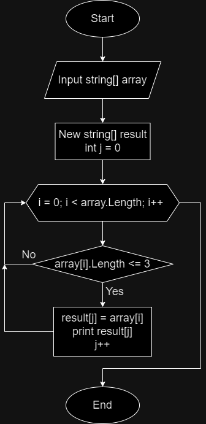

# Решение:
При помощи цикла **for** перебираем каждый эллемент исходного массива. Внутри цикла выполняем условие **if**, проверяя длину строки при помощи **String.Length**. При верном утверждении, что дина строки является меньше или равным трём, присваиваем текущей ячейке нового массива **result** значение проверяемой ячейки исходного массива и выводим результат.

# Блок-схема решения:
